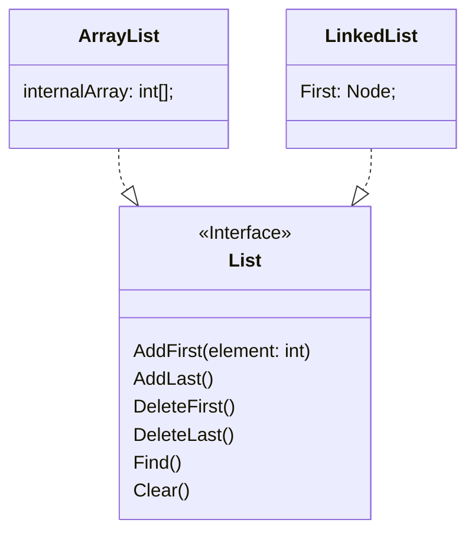

# Introducción
En esta sección se introducen algunos conceptos esenciales sobre tipos de datos que será esencial para la compresión de la programación orientada a objetos.

# Tipos de Datos
Un *tipo de dato* es una clasificación que especifica qué tipo de valores puede tomar una variable, así como las operaciones que se pueden realizar con esos valores. Los tipos de datos se utilizan en la declaración de variables y en la definición de funciones, entre otros usos.

Por ejemplo, en `Python`, los tipos de datos más comunes son:

- **Enteros (int)**: Números enteros como 1, 20, -5.
- **Flotantes (float)**: Números con decimales como 3.14
- **Cadenas (str)**: Secuencias de caracteres como "Hola, mundo!"
- **Booleanos (bool)**: Valores de verdad como True o False

Con respecto a las operaciones que se pueden realizar con estos tipos de datos, por ejemplo, se pueden realizar operaciones aritméticas con enteros y flotantes, concatenar cadenas, y realizar operaciones lógicas con booleanos.

## Tipo de dato simple 
Un *tipo de dato simple* es un tipo de dato que representa un único valor. Los tipos de datos simples son los tipos de datos básicos que se utilizan para representar valores individuales. No tiene sentido práctico separalos en partes más pequeñas.

## Tipo de dato compuesto
Un *tipo de dato compuesto* es un tipo de dato que representa una colección de valores. Los tipos de datos compuestos se utilizan para representar estructuras de datos más complejas que contienen múltiples valores de otros tipos de datos. Por ejemplo, un tipo de dato Cliente, puede contener los datos de nombre, edad, dirección, etc.

## Tipo referencia y tipo valor
Un *tipo de referencia* es un tipo de dato que almacena una referencia a un objeto en memoria. Los tipos de referencia se utilizan para representar objetos que pueden ser compartidos y modificados por múltiples partes de un programa. Por ejemplo, en `Python`, las listas y los diccionarios son tipos de referencia.

Un *tipo de valor* es un tipo de dato que almacena un valor directamente en la memoria. Los tipos de valor se utilizan para representar valores que no pueden ser compartidos ni modificados por múltiples partes de un programa. Por ejemplo, en `Python`, los enteros y los flotantes son tipos de valor.

"Usualmente" los tipos de datos simples son tipos de valor, mientras que los tipos de datos compuestos son tipos de referencia.

# Tipos de Datos Abstractos
Un *tipo de dato abstracto (TDA)* es un modelo matemático que define un conjunto de valores y un conjunto de operaciones que se pueden realizar con esos valores. Los TDAs son una forma de abstracción que permite a los programadores trabajar con datos de manera más abstracta y genérica.

Un TDA especifica una interfaz que define las operaciones que se pueden realizar con los datos, **pero no especifica cómo se implementan esas operaciones**. Esto permite a los programadores utilizar los TDAs sin tener que preocuparse por los detalles de implementación subyacentes. Por tanto, se puede decir que un TDA tiene una vista lógica y una vista física o de implementación. 

En el diagrama anterior, se ilustra como un TDA Lista, puede ser implementado mediante Nodos con memoria dinámica o mediante un arreglo con memoria estática. El API expuesto por el tipo Lista, no debe dar detalles de cómo se implementa internamente.

Una estructura de datos se puede entender como la implementación de TDA. En Programación Orientada a Objetos, un TDA + implementación forman una clase. Algunos lenguajes permiten definir *interfaces* que son un TDA puro.