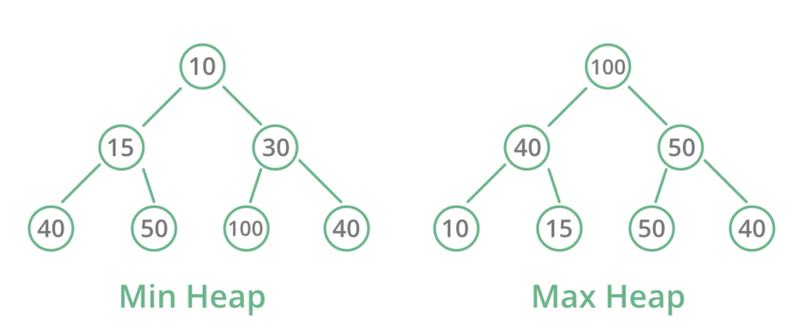
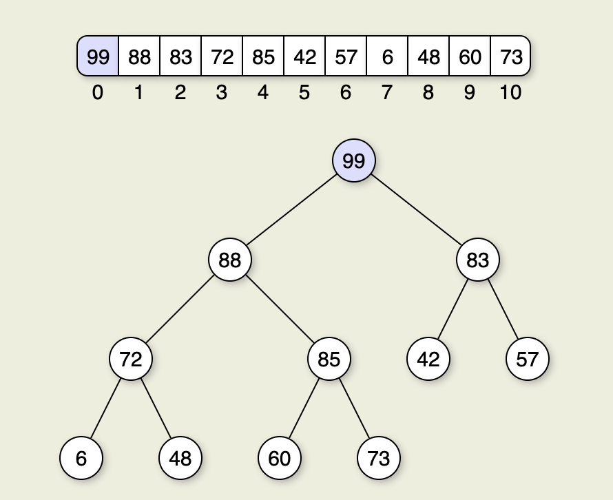

# Árboles Heap (montículo)

- Un árbol _heap_ es un árbol binario completo, es decir, todos los niveles del árbol están completamente llenos, excepto posiblemente el último nivel, que se llena de izquierda a derecha.

- Cumple con la propiedad de _heap_, que establece que el valor de cada nodo es mayor o igual que el valor de sus hijos. Si el valor del nodo es mayor que el de sus hijos, se trata de un árbol **heap máximo**, si el valor del nodo es menor que el de sus hijos, se trata de un árbol **heap mínimo**.

- Visualmente, un árbol _heap_ se puede representar de la siguiente forma:



- Son una opción natural para implementar colas de prioridad.

- Son la estructura esencial para posteriormente implementar _heap sort_ (lo veremos más adelante en los algoritmos de ordenamiento).

## Tipo de dato abstracto

Un heap tiene las siguientes operaciones:

- **Insertar (insert)**: añade un elemento al heap y funciona de la siguinte manera:
  1. Añade el elemento al final del array.
  2. Compara el elemento con su padre y si es mayor, intercambia el elemento con su padre.
  3. Repite el paso 2 hasta que el elemento sea menor que su padre o llegue a la raíz del heap.
- **Eliminar (delete)**: elimina el nodo raíz del heap,
- **Obtener (get)**: permite ver el nodo raíz del heap sin eliminarlo.

```java
public interface IHeap {
    void insert(int element);
    int delete();
    int get();
}
```

## Implementación de árboles heap

Normalmente se implementan sobre un array. La raíz del árbol se almacena en la posición 0 del array, y los hijos de un nodo en la posición `i` se almacenan en las posiciones `2 * i + 1` y `2 * i + 2`.



```java
public class HeapTree {
    private int[] heap;
    private int size;

    public HeapTree(int capacity) {
        heap = new int[capacity];
        size = 0;
    }

    public void insert(int element) {
        if (size == heap.length) {
            throw new IllegalStateException("Heap is full");
        }
        heap[size] = element;
        heapifyUp(size);
        size++;
    }

    public int delete() {
        if (size == 0) {
            throw new IllegalStateException("Heap is empty");
        }

        int root = heap[0];
        heap[0] = heap[size - 1];
        size--;
        heapifyDown(0);

        return root;
    }

    public int get() {
        if (size == 0) {
            throw new IllegalStateException("Heap is empty");
        }

        return heap[0];
    }

    private void heapifyUp(int index) {
        int parentIndex = (index - 1) / 2;

        while (index > 0 && heap[index] > heap[parentIndex]) {
            swap(index, parentIndex);
            index = parentIndex;
            parentIndex = (index - 1) / 2;
        }
    }

    private void heapifyDown(int index) {
        int leftChildIndex = 2 * index + 1;
        int rightChildIndex = 2 * index + 2;
        int largestIndex = index;

        if (leftChildIndex < size && heap[leftChildIndex] > heap[largestIndex]) {
            largestIndex = leftChildIndex;
        }

        if (rightChildIndex < size && heap[rightChildIndex] > heap[largestIndex]) {
            largestIndex = rightChildIndex;
        }

        if (largestIndex != index) {
            swap(index, largestIndex);
            heapifyDown(largestIndex);
        }
    }

    private void swap(int index1, int index2) {
        int temp = heap[index1];
        heap[index1] = heap[index2];
        heap[index2] = temp;
    }
}
```
