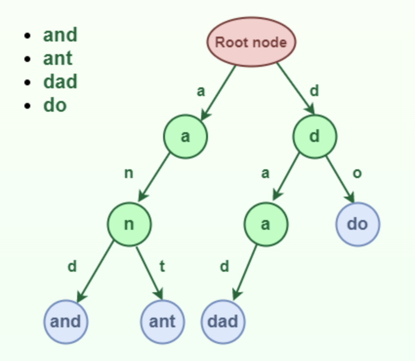
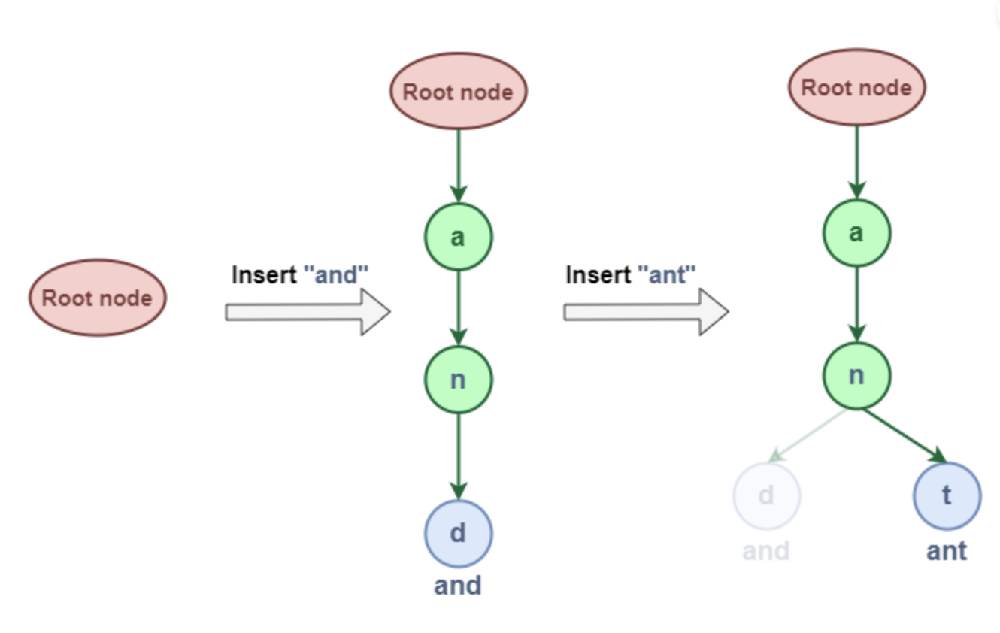

# Introducción a Tries

Un Trie (del inglés _reTRIEval_) es una estructura de datos que permite almacenar un conjunto de cadenas de caracteres y realizar búsquedas de palabras en ellas. Los Tries son árboles de búsqueda n-arios que almacenan cadenas de caracteres, donde cada nodo del árbol representa un carácter. Los Tries son útiles para realizar búsquedas de palabras en un conjunto de cadenas de caracteres, como en diccionarios o en motores de búsqueda.

> Se pronuncia como el inglés _try_.

Visualmente, un trie se puede ilustrar como:



Cada rama de un nodo corresponde a un caracter de la llave insertada. El último nodo de cada llave se conoce como _EndOfWord_. La raíz no tiene un valor asignado.

# El TDA Trie

El TDA Trie tiene las siguientes operaciones básicas:

- **Insertar (insert)**: añade una cadena de caracteres al trie,
- **Buscar (search)**: busca una cadena de caracteres en el trie,
- **Eliminar (delete)**: elimina una cadena de caracteres del trie.
- **Recorrer (traverse)**: recorre todas las cadenas de caracteres del trie.
- **Completar (autocomplete)**: busca todas las cadenas de caracteres que comienzan con un prefijo.

# Implementación de un Trie

## Estructura básica

```java
class TrieNode
{
    TrieNode[] children = new TrieNode[ALPHABET_SIZE];
    boolean isEndOfWord;
}
```

## Inserción

Insertar una _llave_ en un Trie es un proceso simple:

- Cada caracter de la llave se inserta como un nodo Trie individual.
- Los hijos de un nodo son un arreglo de punteros (o referencias) a los nodos del siguiente nivel del trie.
- El caracter de la llave actúa como un índice para el arreglo de hijos. Si la llave de entrada es nueva o una extensión de la llave existente, se construyen nodos no existentes de la llave y se marca el final de la palabra para el último nodo.
- Si la llave de entrada es un prefijo de la llave existente en el Trie, simplemente se marca el último nodo de la llave como el final de una palabra.

La longitud de la llave determina la profundidad del Trie.


