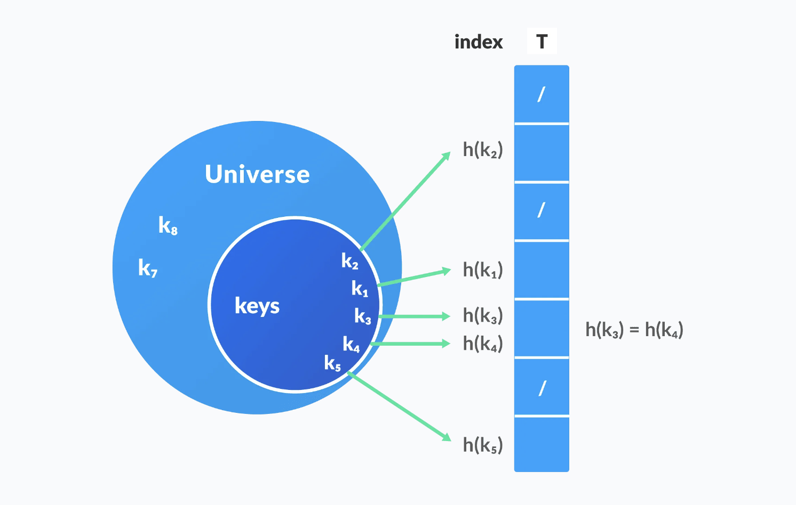
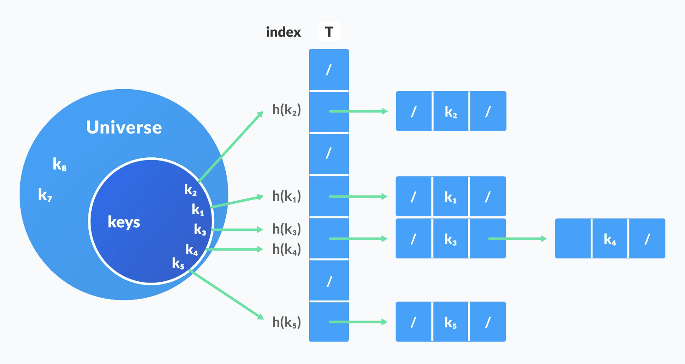

# Introducción a Hash Search

Para buscar en grandes colecciones de datos, no necesariamente ordenados, _hashing_ (dispersión) provee una técnica para buscar de una forma más eficiente. La función de hash se utiliza para transformar una o más características de cada elemento del universo de búsqueda en una valor numérico que corresponde a un índice de un array. La búsqueda con _hash_, tiene un mejor rendimiento promedio que otros algoritmos de búsqueda.

## Hash tables

Es una estructura de datos que almacena datos en pares _llave-valor_:

- _Llave_: llave única para identificar un valor
- _Valor_: dato asociado con la llave

La llave _k_ se utiliza como entrada para una función de hashing _h(k)_ que genera un índice i donde el valor se almancenará dentro de la tabla. Visualmente se puede representar de esta forma:

Por ejemplo, suponga que se tiene un conjunto de datos que representan ciudadadanos costarricenses, donde cada registro, contiene una cédula numérica que identifica cada registro.

| Cédula    | Nombre | Apellido  | Dirección |
| --------- | ------ | --------- | --------- |
| 123456789 | Juan   | Pérez     | San José  |
| 987654321 | María  | Rodríguez | Heredia   |
| 456789123 | Carlos | Sánchez   | Alajuela  |

Para buscar un ciudadano en particular, se puede utilizar la cédula como llave y almacenar los datos en una tabla _hash_. Si la función de hash es _h(cédula) = cédula % 10_, se puede almacenar los datos de la siguiente forma:

| Índice | Cédula    | Nombre | Apellido  | Dirección |
| ------ | --------- | ------ | --------- | --------- |
| 0      |           |        |           |           |
| 1      | 987654321 | María  | Rodríguez | Heredia   |
| 2      |           |        |           |           |
| 3      | 456789123 | Carlos | Sánchez   | Alajuela  |
| 4      |           |        |           |           |
| 5      |           |        |           |           |
| 6      |           |        |           |           |
| 7      |           |        |           |           |
| 8      |           |        |           |           |
| 9      | 123456789 | Juan   | Pérez     | San José  |

La función de hash seleccionada, determine la cantidad de _buckets_ (espacios de almacenamiento) que se utilizarán para almacenar los datos. En este caso, se utilizó el módulo 10 para determinar el índice de almacenamiento.

El reto de las funciones hash es generar un índice único para cada llave. Si dos llaves generan el mismo índice, se produce una colisión. Las colisiones se pueden resolver de diferentes formas:

- **Separate chaining**: Cada índice de la tabla _hash_ almacena una lista enlazada de elementos que colisionan. Visualmente se puede ver de la sigueinte forma:

- **Open addressing**: Se busca un índice alternativo para almacenar el elemento que colisiona.
