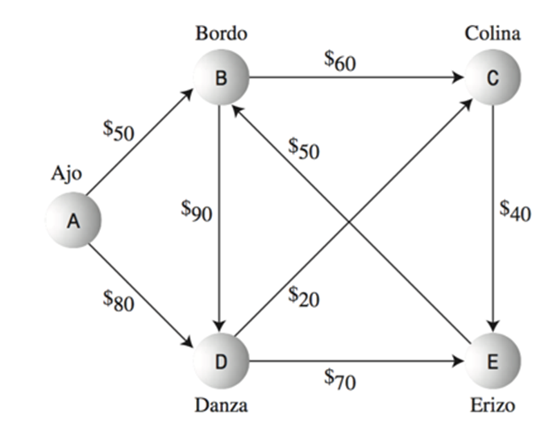

# Camino más corto: Dijkstra

Uno de los problemas más comunes es determinar el camino más corto entre un par de nodos.
Para este tipo de problema consideramos un grafo dirigido y ponderado.

La longitud del camino más corto es la suma del peso de cada arista.
El algoritmo de Dijkstra encuentra el camino más corto desde un nodo de origen a todos los demás nodos en un gráfico con pesos positivos

Edsger Dijkstra (1930 - 2002) fue un informático holandés que dio forma a la programación informática como una ciencia reconocida.
¿Cómo funciona?



1. Se utilizará una tabla donde la primera columna es el vertice, la segunda es el peso temporal que se le dará a un camino y en la tercera columna el peso final. 


| Vertice | Temporal | Final |
|---------|----------|-------|
|   A     |    0     |   0   |
|   B     |   50     |  50   |
|   C     |  110     | 110   |
|   D     |   80     |  80   |
|   E     |  150     | 150   |


2. Escoger un punto de salida y otro de entrada. A -> E.
3. Empezar por los nodos adyacentes al de salida y analizando su peso, este se coloca en la columna temporal.
4. Se debe escoger el de magnitud más corta y se coloca este número en peso final. A partir de este nodo se le analizan sus adyacentes pero la magnitud es la suma del peso final + el peso que exista en las aristas.
5. Se analiza cual es el menor y a partir de ahí se sigue analizando.
*En este caso la distancia mas corta es A -> D -> E*

### Estructura general 

```
Foreach node set distance [node] = HIGH
SettledNodes = empty
UnSettledNodes = empty

Add sourceNode to UnsettledNodes
distance[sourceNode] = 0
while (UnSettledNodes is not empty) {
    evaluationNode = getNodeWithLowestDistance(UnSettledNodes)
    remove evaluationNode from UnsettledNodes
        add evaluationNode to SettledNodes    evaluatedNeighbors(evaluationNode)
}
getNodeWithLowestDistance(UnSettledNodes){  
    find the node with the lowest distance in UnSettledNodes and return it 
}
evaluatedNeighbors(evaluationNode){  
    Foreach destinationNode which can be reached via an edge from evaluationNode AND which is not in SettledNodes {    
        edgeDistance = getDistance(edge(evaluationNode, destinationNode))    
        newDistance = distance[evaluationNode] + edgeDistance    
        if (distance[destinationNode]  > newDistance) {      
            distance[destinationNode]  = newDistance 
        evaluation.predecessor = evaluationNode      
            add destinationNode to UnSettledNodes    
        }  
    }
}
```