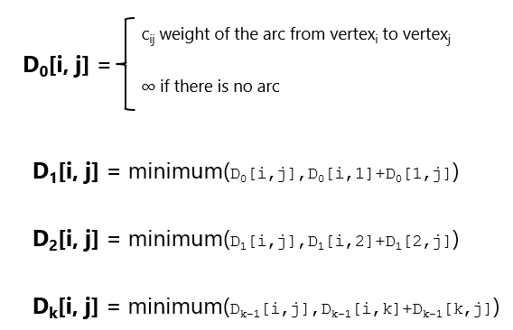
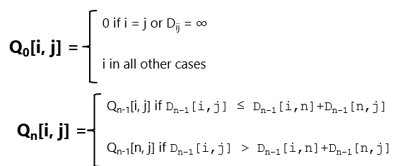
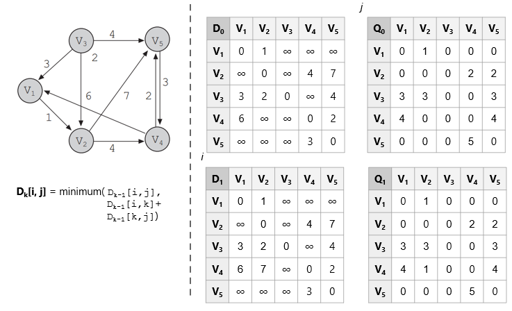
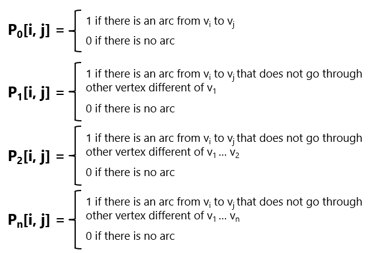
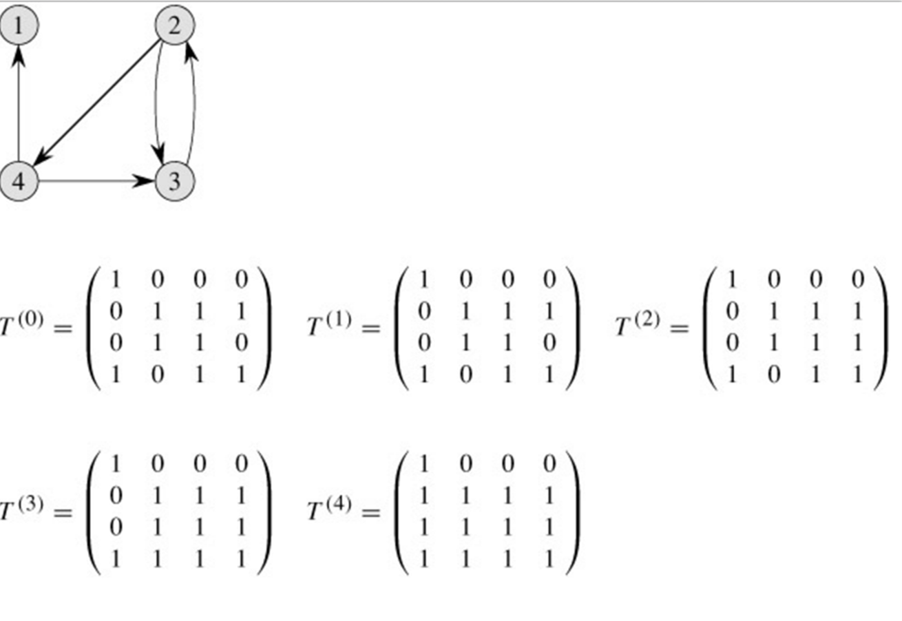

# Camino más corto: Floyd

¿Cómo calcular el camino más corto de cada nodo a cada nodo?
Existe una solucón más directa que usar dijsktra de nodo en nodo.

El algoritmo de Floyd calcula mediante programación dinámica el camino más corto de cada nodo a cada nodo.

El algoritmo de Floyd representa el gráfico como una matriz ponderada. Cada arco (vi, vj) tiene un peso c~ij~. Si el arco no existe, el valor es ∞.
La diagonal de la matriz es igual a cero.

El algoritmo de Floyd determina una nueva matriz D de nxn elementos, donde cada D~ij~ es el camino mínimo de v~i~ a v~j~

- En cada paso desde D~0~ se genera una nueva matriz D~1~, D~2~, ..., D~k~, D~n~. En cada paso se incluye un nuevo vértice para determinar si ese vértice mejora los caminos para que sean más cortos. 

- Otra matriz Q~1~, Q~2~,..., Q~k~, Qn se genera en cada paso desde Q~0~. Q es la matriz predecesora.

----------------------------

# Warshall

Similar al algoritmo de Floyd. Calcula la matriz de camino P (también llamada cierre transitivo) de un grafo G de n vértices, representado por su matriz de adyacencia A.

Define una secuencia de matrices nxn P~0~, P~1~, P~2~, P~3~,… P~n~

