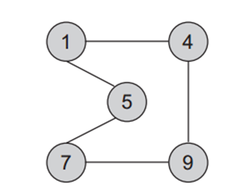
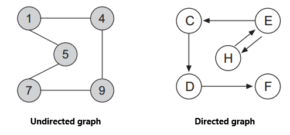
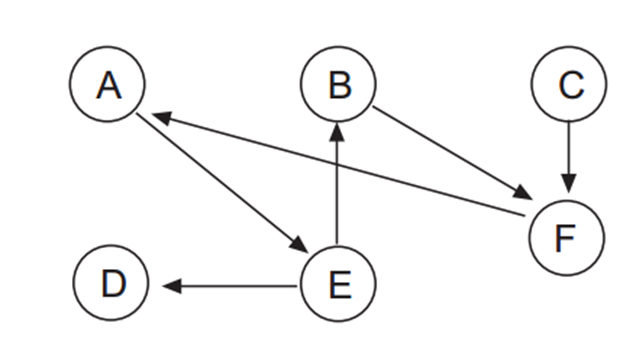
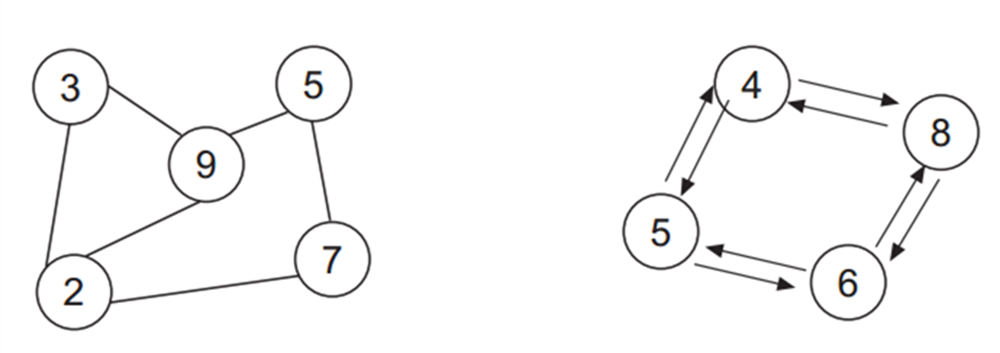
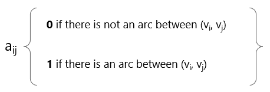
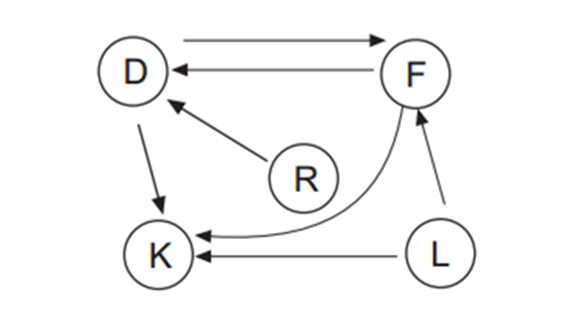
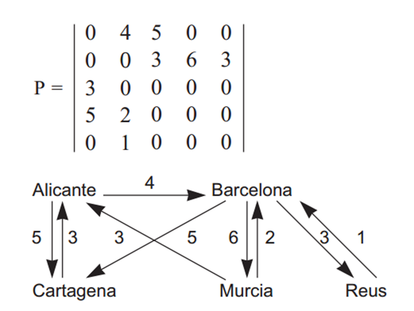
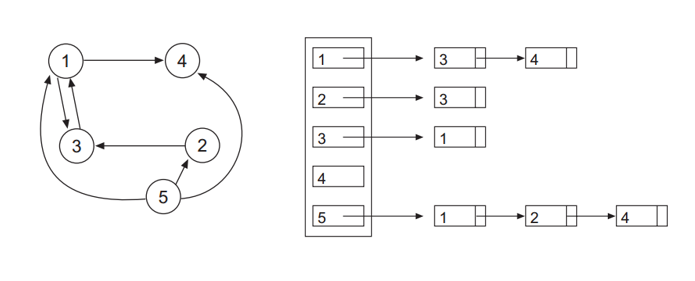
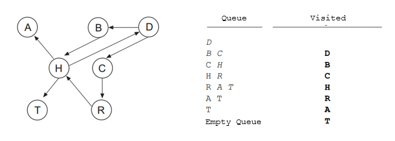
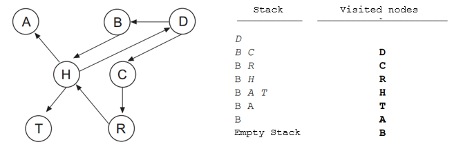

# Introducción a los grafos

Los grafos son estructuras de datos generales que tienen un gran rango de aplicaciones. 

- Sociología
- Química
- Geografía
- Ingeniería Electrica
- Ingenieria Industrial

## Denotación de un grafo

Un grafo G agrupa entidades físicas o conceptuales. Un grafo está compuesto por:
- Vértices, nodos o puntos que representan cada una de las entidades
- Aristas, arcos o líneas que representan relaciones entre nodos.

Un grafo está denotado como G = {V,A}



V = { 1, 4, 5, 7, 9 } 
A = { (1,4), (4,1), (1,5), (5,1), (4,9), (9,4), (5,7),(7,5) (7,9),(9,7) }


Un grafo puede  dirigido y no dirigido):


- En los dirigidos se muestra la dirección de la relación entre los nodos.
- En los no dirigidos los nodos conectados son adyacentes.

## Definiciones importantes

Una arista puede tener un peso asociado denotando la magnitud asociada a la relación. Este tipo de grafos se les llama *Grafos ponderados*
- El grado de v es una cualidad de un nodo de un grafo. En un grafo no dirigido es el número de aristas que contiene v.
- En un grafo dirigido, el grado de entrada es el número de extremos de cola adyacentes a v. El grado de salida es el número de extremos de cabeza adyacentes a v.

La ruta P = (v~0~, v~1~, v~2~, … , v~n~) es una serie de vertices que forman la ruta desde v~0~ hasta v~n~. v~n~ y v~0~ pueden ser iguales.
Si los vértices entre v~0~ y v~n~ son diferentes, la ruta se llama ruta simple.

Un ciclo es una ruta simple que empieza y termina en el mismo nodo.


Un DAG es un grafo aciclico dirigido, o sea que no existen ciclos.


Un grafo es conexo si existe un camino entre cualquier par de nodos que lo componen.
Un grafo es fuertemente conexo si el grafo es conexo y es un dígrafo.

# Representación 

Los grafos se pueden representar utilizando dos enfoques diferentes:
- Usando una matriz bidimensional conocida como matriz de adyacencia
- Usando una representación dinámica conocida como lista de adyacencia

Elegir entre una representación u otra depende del tipo de array y de las operaciones que se realizarán:
- Si el grafo (muchas aristas), lo mejor es escoger la matriz.
- Si el grafo es disperso, lo mejor es escoger la lista enlazada.

## Matriz de adyacencia

Sea G = {V, A} donde V = {v~0~, v~1~, v~2~,…, v~n-1~} y A = {(vi, vj)}. Los nodos se pueden representar mediante la matriz A de nxn conocida como matriz de adyacencia. Cada elemento de aij puede tomar uno de los siguientes valores:



- Por ejemplo, digamos que los nodos son {D, F, K, L , R} la matriz sería
```
    |0  1  1  0  0 |
    |1  0  1  0  0 |
A = |0  0  0  0  0 |
    |0  1  1  0  0 |
    |1  0  0  0  0 |
```



- Si el grafo es ponderado



## Lista de adyacencia

Una lista de adyacencia es una lista vinculada donde cada elemento representa un nodo del grafo. Cada elemento contiene una lista de relaciones con otros nodos, siendo el nodo del elemento, el origen.



# Transversales de un grafo

Atravesar un grafo implica visitar todos los nodos accesibles comenzando desde un nodo específico
Algoritmo de recorrido básico:
- Sea V el conjunto de vértices del gráfico.
- Sea W el conjunto de nodos no visitados. Inicialmente solo contiene el nodo inicial v
- Sea Y el conjunto de nodos visitados.
- En cada paso del algoritmo, se elimina un nodo w, se procesa y para cada borde de w, si no se visita, se agregará a w
- El algoritmo termina cuando W está vacío

## Breadth-First 

Utiliza una cola que mantiene los vértices marcados.

FIFO logra que a partir de v, primero se procesen todos los vértices adyacentes, luego todos los adyacentes de los adyacentes de v...y así sucesivamente

Algoritmo:
1. Marque el nodo de inicio v
2. Poner en cola el nodo de inicio v
3. Repita los pasos 4 y 5 hasta que la cola esté vacía.
4. Sacar de cola el nodo w de la cola, procesar w
5. Ponga en cola todos los nodos adyacentes a w que no estén marcados, nodos en cola marcados
6. Fin



## Depth-First

En Depth-First, el orden de procesamiento viene dado por un enfoque LIFO
Atravesar el grafo con un nodo v. v se marca como visitado y se empuja a la pila. La parte superior de la pila está reventada. Cada nodo adyacente de v no visitado se empuja a la pila.

Esto continua hasta que no haya más elementos en la pila.

