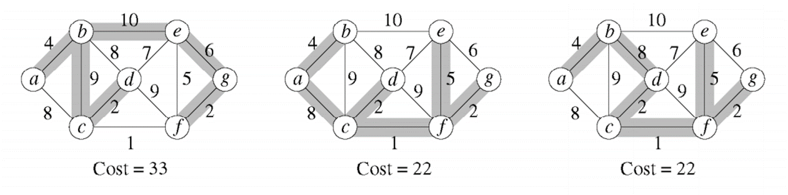

# Minimal Spanning tree

Se utiliza un grafo no dirigido para modelar relaciones simétricas entre vértices del gráfico. Cualquier arco (v,w) de un grafo no dirigido es igual que el arco de (w,v).

Una tarea común es determinar si para cualquier par de vértices existe un camino que los conecte, es decir, **si es un grafo conexo**.

Un *árbol de expansión mínimo* es un subconjunto del grafo que cubre todos los vértices y cuyos bordes tienen una suma de los pesos mínimos.
- Aplicado en redes

Un **árbol** es un subconjunto del grafo que está conexo y no tiene ciclos.
- Si tiene n vértices, entonces tiene n-1 aristas.
- Existe un camino único entre dos vértices cualesquiera de un árbol.
- Si se agrega una ventaja, se produce un ciclo.

Si todos los vértices están en el árbol, entonces es un grafo conexo.

Dado un grafo no dirigido, encuentre el árbol de expansión mínimo

- El mismo grafo puede tener varios arboles de expansión, pero no tofos son el mínimo.

### ¿Como conseguirlo?

    - Prim algorithm
    - Kruskal algorithm
    
