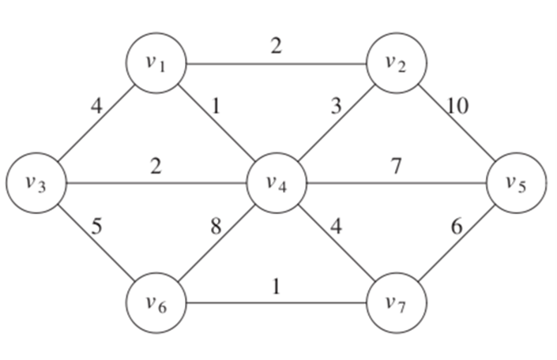
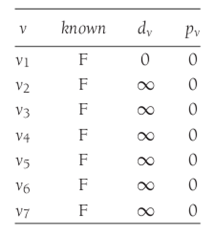
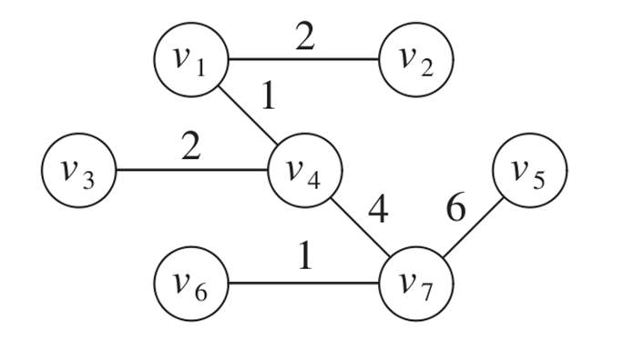
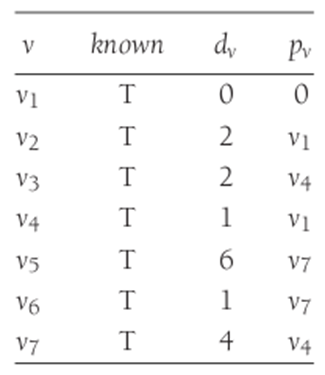
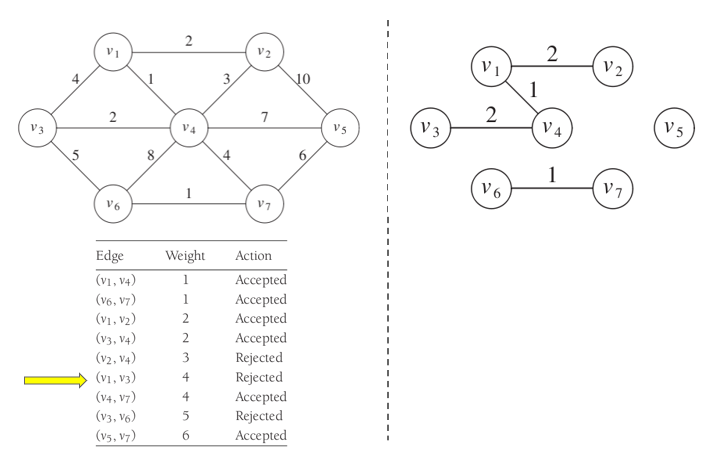

# Prim

El árbol crece en etapas sucesivas. En cada etapa, se elige un nodo como raíz y agregamos un borde y el vértice asociado al árbol.

En cualquier punto tenemos un conjunto de vértices que ya han sido incluidos en el árbol.

El algoritmo encuentra un nuevo vértice para agregar al árbol eligiendo el borde (u,v), tal como el costo de (u,v) es el más pequeño entre todos los bordes donde u está en el árbol y v no.

*Peso mínimo conectado a un nodo conocido*

Al realizar todo el algoritmo el resultado se vería así:

# Kruskal

Selecciona bordes si el orden es de menor peso y acepta un borde si no causa un ciclo

Mantiene un bosque (colección de árboles). Inicialmente todos son árboles de un solo nodo. Agregar un borde fusiona dos árboles en uno

Si u y v están en el mismo conjunto, la arista (u,v) se rechaza, porque sumarla causaría un ciclo. u y v están en el mismo conjunto si están conectados.

