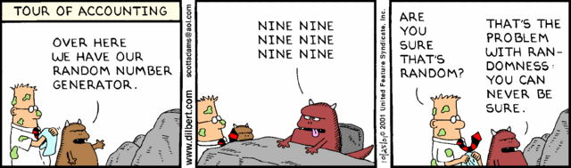
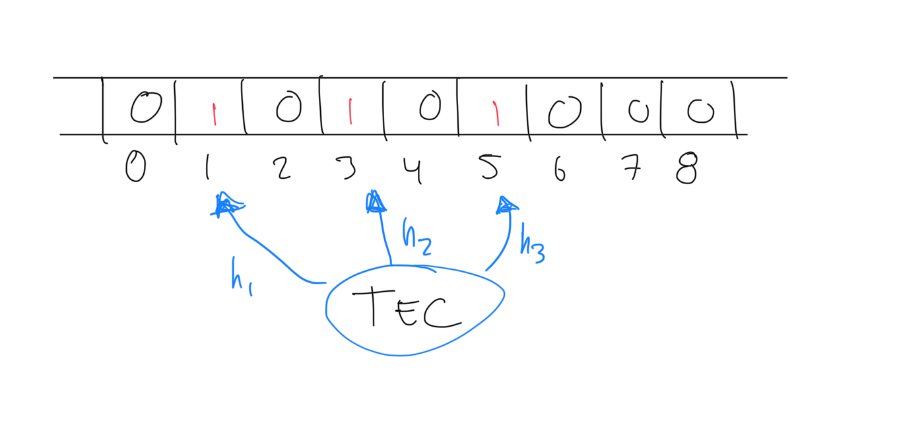
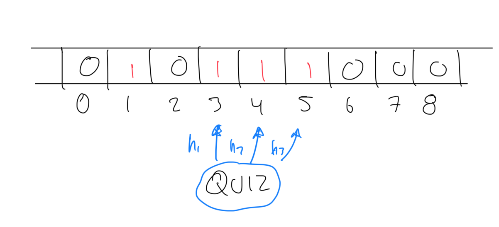

# Introducción

Son algoritmos que utilizan aleatoriedad para tener una mejora en desempeño sacrificando la confiabilidad de los resultados obtenidos:

- No se produce ningun resultado
- Se produce un resultado incorrecto
- Se produce una respuesta aproximada

Ejecuciones distintas pueden producir respuestas distintas.

# Clasificación

- **Monte Carlo**: Algoritmos que **siempre** retornan un resultado, pero puede no ser correcto. Se intenta minimizar la probabilidad de error. Multiples ejecuciones reducen dicha probabilidad.
- **Las Vegas**: Algoritmos que **siempre** retornan un resultado correcto, pero pueden producir ningún resultado. Múltiples ejecuciones reducen la probabilidad de no obtener un resultado.

# Aleatoriedad

- Provisto por un generador de números random. Estos generadores son pseudo-aleatorios, ya que generan una secuencia de números que parecen ser aleatorios, pero son deterministas. El único valor random que existe en nuestra realidad es la decadencia radioactiva.
- Los generadores de pseudo-random generan números en una secuencia dentro de un rango y requieren un elemento inicial llamado semilla (seed). Cada número en la secuencia se genera a partir del anterior.
- Hay posibilidad de ciclos dado que un número puede repetirse en la secuencia.



## Ejemplo de pseudo-random: Método de cuadrado medio

Eleve el número inicial (seed) al cuadrado y tome los dígitos del medio como el nuevo número. Por ejemplo, si el seed es 1234, el cuadrado es 1522756 y el número medio es 2275.

Una secuencia sería:

- 1234 (semilla)
- 2275 (1234^2)
- 5180 (2275^2)
- 6884 (5180^2)

y así sucesivamente. Dependiento de la semilla, la secuencia puede ser cíclica muy rápido.

# Algoritmos de Monte Carlo

Considere el siguiente requerimiento: "Dado un array de N elementos, determinar si hay un elemento que sea mayoritario, es decir que aparezca más de N/2 veces"

La solución trivial sería:

1. Recorra el array y cuente cuántas veces aparece cada elemento.
2. Si encuentra un elemento que aparece más de N/2 veces, retorne verdadero.

El problema es que la complejidad de este algoritmo es O(N^2) y no es eficiente.

Utilizando un algoritmo de Monte Carlo, tendríamos:

```java
boolean tieneElementoMayoritario(array, lenght) {
    i = random(0, n - 1);
    x = array[i];
    k = 0;
    for (j = 0; j < n; j++) {
        if (array[j] == x) {
            k++;
        }
    }
    return k > n / 2;
}
```

Como se puede notar, podría devolver `false` aún cuando no haya un elemento mayoritario. La probabilidad de error es de 1/2.

Ejecutar varias veces el algoritmo reduce la probabilidad de error (si el psuedo-random es bueno). Después de k ejecuciones, la probabilidad de error es de 1/2^k.

# Algoritmos de Las Vegas

Características:

- No garantizan un resultado y no tiene un uppber-bound en tiempo de ejecución. Siempre se obtiene un resultado correcto, pero no siempre se obtiene un resultado.

- Utilizados para explorar un espacio de soluciones de las cuales algunas son las correctas. Usan random para moversen en dicho espacio de soluciones. Si hay muchas soluciones correctas, la probabilidad de encontrar una es alta en poco tiempo.

Considere el problema de las n-reinas. La solución clásica es mediante backtracking. Sin embargo, un algoritmo de Las Vegas podría ser:

1. Colocar las reinas en posiciones aleatorias, una en cada columna
2. Verificar si hay colisiones
3. Si no hay colisiones, retornar la solución
4. Si hay colisiones, repetir el proceso

# Estructuras de datos probabilísticas

- Proveen respuestas aproximadas a consultas sobre grandes sets de datos.
- Sacrifican precisión para fomentar eficiencia temporal.
- Utilizan _hashing_ y _randomness_ para reducir la complejidad espacial y temporal.

> Una diferencia clave de las estructuras probabilísticas con respecto a los algoritmos probabilísticos, es que estos últimos no necesariamente se comportan de forma impredecible para el usuario. Es decir, pueden devolver resultados correctos. Las estructuras de datos probabilisticas, no dan respuestas definitivas.

## Filtros de Bloom

Considere el siguiente escenario:

> La página de regitro de usuarios de un sitio web, permite al usuario especificar un _username_. No se permiten _username_ duplicados. ¿Cómo se puede verificar si un _username_ ya existe?

Algunas posible soluciones serían:

- Aplicar búsqueda secuencial, pero el problema es que la complejidad es O(N) y si tenemos millones de usuarios, la búsqueda sería muy lenta.
- Búsqueda binaria, que es mucho mejor, pero requeriría tener ordenados los usuarios y cargados en memoria.

Un filtro de Bloom permite determinar si un elemento pertenece a un set o no. Al ser probabilístico, puede dar falsos positivos (sí está), pero no falsos negativos.

- Utiliza un array de bits de tamaño fijo para representar todo el set de datos
- Agregar un element set nunca falla, pero los falsos positivos aumentan conforme el set se llea
- Nunca genera falsos negativos
- No se pueden eliminar elementos del set

### Implementación

Se utiliza un arreglo de bits de largo m.


Se necesitan k funciones de hash. Para agregar un elemento, se calculan las k funciones de hash y se setean los bits correspondientes a 1. Por ejemplo, si se define que se van a usar 3 funciones de hash, y se va a insertar la palabra "TEC" en el set:

h1(TEC) % m = 1
h2(TEC) % m = 3
h3(TEC) % m = 5



Ahora agregamos la palabra "QUIZ":

h1(QUIZ) % m = 3
h2(QUIZ) % m = 5
h3(QUIZ) % m = 4



Como se puede notar, en este caso, TEC y QUIZ tuvieron algunos resultados similares. El set se comienza a llenar, activando bits que no necesariamente corresponden a elementos diferentes.

Supongamos que se busca la palabra "PERRO", la cual no se ha insertado aún, y que las funciones de hash generan los siguientes valores:

h1(PERRO) % m = 1
h2(PERRO) % m = 4
h3(PERRO) % m = 5

Estos índices ya están en 1, por lo que el filtro de Bloom dirá que el elemento está en el set, cuando en realidad no lo está. Esto es un falso positivo.

Depende del tipo de aplicación, puede ser que esto sea aceptable. Por ejemplo, en el caso de la verificación de _username_, si el filtro de Bloom dice que el _username_ ya existe, se puede hacer una verificación adicional para confirmar. Pero si el filtro dice que no existe, entonces no se necesita hacer nada más y se ahorra tiempo considerable.

> Probabilidad de un falso positivo: `P(1 - [1 - 1/m]ˆkn)^k`

### Complejidad:

- Tiempo de inserción: O(k)
- Tiempo de búsqueda: O(k)
- Espacio requerido: O(m)

### Selección de la función de hash

- Deben ser funciones rápidas
- Usar hash criptográfico proveerá una mayor estabilidad pero tiene un hit de performance muy importante

### Aplicaciones conocidas de filtros de bloom

- Medium.com lo utiliza para identificar los post ya vistos por el usuario
- Cloudflare lo utiliza para identificar IPs maliciosas
- Google Chrome lo utiliza para identificar URLs maliciosas
- Apache Cassandra lo utiliza para buscar registros inexistentes en disco
