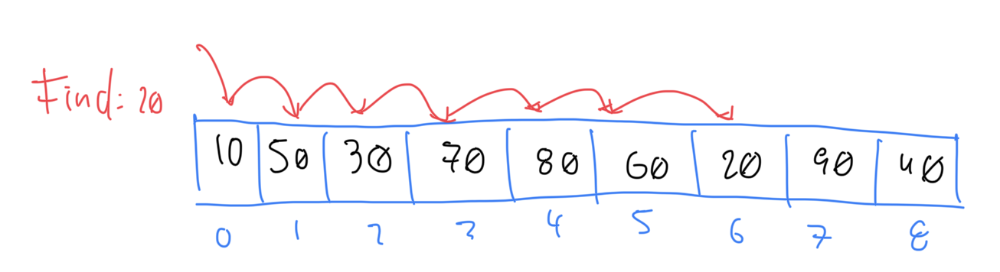

# Introducción

Búsqueda secuencial es la solución trivial para buscar en una colección de elementos. Cuando la colección está desordenada, es la única opción. Revisa/procesa cada elemento hasta encontrar el elemento deseado.

- En el peor caso, cada elemento de la colección es comparado contra la llave de búsqueda
- Si hay un _match_, la búsqueda termina y se retorna el índice del elemento
- Si no hay _match_, se retorna -1 (u otro índice negativo)

Por ejemplo, dado el siguiente array, para buscar el elemento `20`, se seguiría el siguiente proceso:



# Implementación

```java
public class SequentialSearch {
    public static int search(int[] arr, int x) {
        for (int i = 0; i < arr.length; i++) {
            if (arr[i] == x) {
                return i;
            }
        }
        return -1;
    }
}
```

# Time complexity

- Worst-case: O(n)
- Best-case: O(1)

# Consideraciones importantes

- Es ineficiente para colecciones grandes
- Si el array no está ordenado o se quiere evitar ordenar, es la única opción
