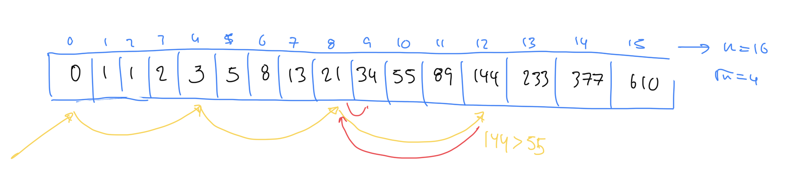

# Introducción

- Aplicable para arrays ordenados
- Compara menos elementos que búsqueda lineal saltándose _n_ elementos a la vez
- Determinar el tamaño del bloque de saltos es crucial para el rendimiento del algoritmo
- Normalmente se utiliza √n como tamaño de bloque, donde n es el tamaño del array

# Complejidad

Complejidad temporal: O(√n)

# Referencias

- https://www.geeksforgeeks.org/jump-search/
