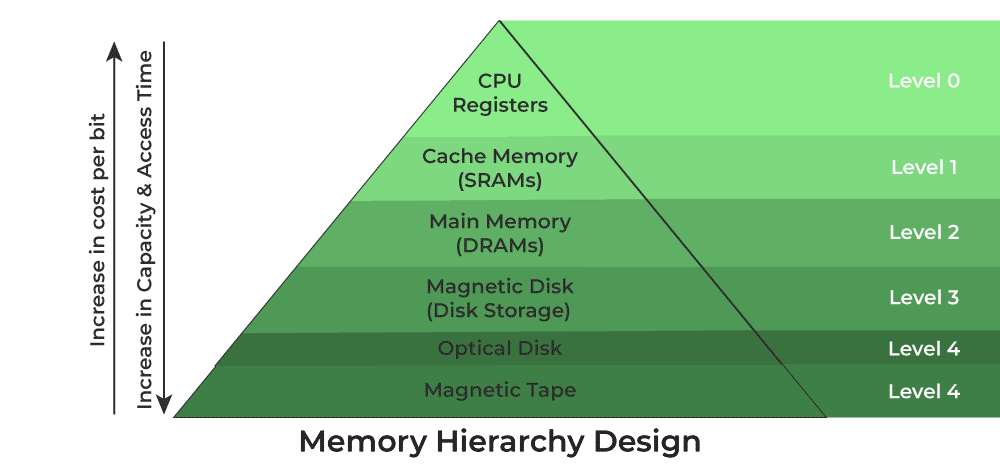

# Introducción

La jerarquía de memoria, se puede representar con la siguiente pirámide:

Conforme se "sube" en la jerarquía, la cantidad de memoria disminuye pero el costo y velocidad de la misma aumentan. Conforme se desciende, el costo y velocidad disminuyen pero la cantidad de memoria aumenta. Es por eso, que el cache, es una memoria muy rápida pero de poca capacidad, mientras que el disco duro es una memoria lenta pero de gran capacidad.

# Conceptos esenciales

- **Dato**: Sucesión de símbolos representados con números o letras. No contienen ninguna información en sí mismo, sino que representan un _hecho_ con algún significado dado por una unidad y su magnitud. Requieren organización y procesamiento para extraer información. Por ejemplo: _$10, 20 años, 3 kg, 10 metros, 22 km_.

- **Información**: Es la interpretación significativa de los datos

- **Sistemas de almacenamiento**: Sistemas para almacenar datos en formato binario sin importar la información que se pueda extraer de dichos datos. Solo ven bloques crudos de bits.
