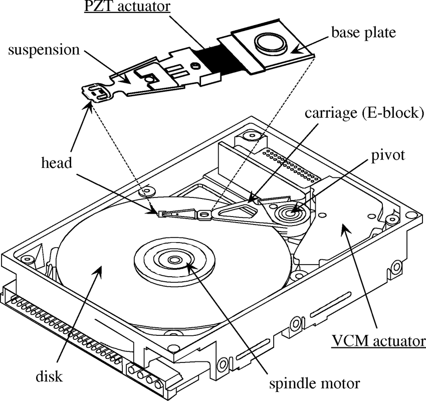
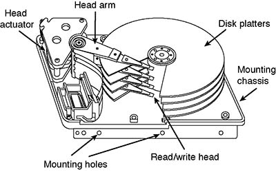

# Discos Duros (Hard-disk drives)

> No deben confundirse con discos de estado sólido (SDD).

Son dispositivos de almacenameinto persistente que mantiene la información almacenada incluso cuando no están siendo alimentados con electricidad.

- Los datos se almacenan mediante magnetización de particulas dentro del material mangnético de los discos.

- El disco es capaz leer los datos al detectar los patrones de magnetización creados al escribir los datos.

## Componentes

- _Platos_: Discos circulares de material magnético en ambas caras
- _Eje_: sostiene uno o más platos conectados a un motor que gira los platos a un RPM constante.
- _Brazo actuador_: Mueve las cabezas de lectura/escritura a lo largo de los platos.
- _Cabezales_: Dispositivos electromagnéticos que leen y escriben datos en los platos.
- _Hard disk assembly_: Combinación de los platos, eje, brazo actuador y cabezales.

## Funcionamiento

La velocidad del giro inflencia directamente a la velocidad de I/O. A mayor velocidad, mayor consumo energético y mayor costo.

- Velocidaddes para uso general (consumidor):

  - 5400 RPM
  - 7200 RPM

- Velocidades para uso profesional (servidores):
  - 10000 RPM
  - 15000 RPM

Los datos se escriben en círculos concentricos llamados _pistas_ y se dividen en _sectores_. Un sector es la unidad mínima de almacenamiento en un disco duro y generalmente tiene un tamaño de 512 bytes.

## Tiempos de acceso

El tiempo de búsqueda (seek time) es el tiempo que tarda el brazo actuador en moverse a la pista deseada (8 - 10ms en discos de 7200 RPM). El tiempo de latencia es el tiempo que tarda el sector deseado en pasar por debajo de la cabeza de lectura/escritura (4 - 5ms en discos de 7200 RPM).

El tiempo de acceso total es la suma del tiempo de búsqueda y el tiempo de latencia.

## Tiempo de transferencia

Los discos duros tienen un tiempo de transferencia que es el tiempo que tarda en leer o escribir un bloque de datos. Este tiempo depende de la velocidad de rotación del disco y de la densidad de los datos. Por ejemplo, un disco de 7200 RPM tiene un tiempo de transferencia de 0.5ms.

El external data rate es la cantidad de datos que se pueden transferir por segundo. Por ejemplo, un disco de 7200 RPM con un external data rate de 300MB/s puede transferir 300MB de datos por segundo.

## Interfaces

El HDD se conecta a otros components de la computadora a través de una interfaz. Las interfaces más comunes son:

- PATA (Parallel Advanced Technology Attachment)

  - Interfaz de 40 pines que se conecta a la placa madre.
  - Velocidad de transferencia de 133MB/s.
  - No es hot-swappable.
  - No se usa en la actualidad.
  - Solo para discos internos

- SATA (Serial Advanced Technology Attachment)

  - Evolución de PATA.
  - Estandar en computación moderna.
  - Velocidad de transferencia de 600MB/s.
  - Bajo consumo energético.
  - Hot-swappable.

- SCSI (Small Computer System Interface)

  - Interfaz de alta velocidad.
  - Se usa en servidores y estaciones de trabajo.
  - Hot-swappable.

- SAS (Serial Attached SCSI)
  - Evolución de SCSI.
  - Velocidad de transferencia de 12GB/s.
  - Hot-swappable.
  - Se usa en servidores y estaciones de trabajo.
