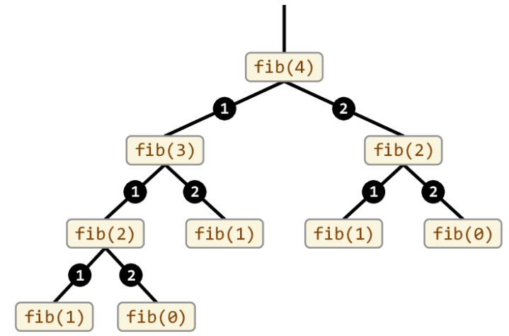
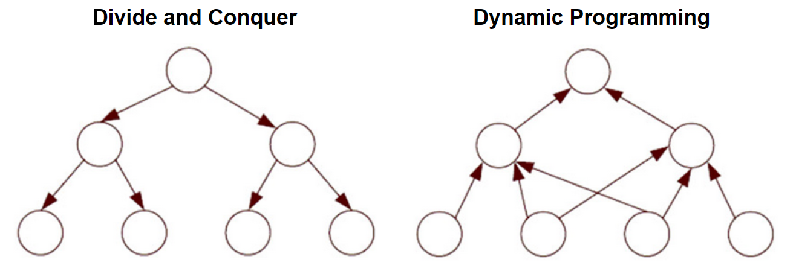

# Programación dinámica (DP)
Aunque tiene el término _programación_ en su nombre, no se refiere a escritura de código fuente. Acuñado por Richard Bellman en los años 50, _programar_ se referiere a _planificar_, es decir, planificar óptimamente procesos de múltiples etapas.
- Comparte similutudes con la técnica de _divide y vencerás_.
- DP divide problemas en sub-problemas y _memoiza_ las soluciones de los sub-problemas para resolverlos una *sola vez*.
- En DP, los sub-problemas se translapan, es decir, el resultado de uno puede ayudar a resolver otro.

> **Memoización vs Memorización <br/>**
> Memoización se refiere a una técnica para optimizar recordando. Memorizar se refiere a poner algo en la memoria.

Por ejemplo, para calcular _fibonacci(4)_ utilizando un enfoque tradicional:



Se puede notar un claro traslape de sub-problemas, lo que implica un desperdicio de recursos computacionales. Utilizando un enfoque de DP, el problema se puede resolver de la siguiente manera:

```java
int fib(n) {
    mem[n + 2]; // ------------------> En caso que N sea 0 o 1
    mem[0] = 0;
    mem[1] = 1;

    for (i = 2; i < n + 1; i++) {
        mem[i] = mem[i - 1] + mem[i - 2];
    }
    return mem[n];
}
```

El código anterior utilizaría internamente, un arreglo que se vería de la siguiente manera:

```
mem[0] = 0
mem[1] = 1
mem[2] = 1
mem[3] = 2
mem[4] = 3
```

En el enfoque divide y conquista, el algoritmo de Fibonacci tiene una complejidad de tiempo de `O(2^n)`. En cambio, con DP, la complejidad de tiempo se reduce a `O(n)`.

El siguiente diagrama ilustra el enfoque DP vs Divide y Vencerás de forma general:



## Ejemplo de programación dinámica: Longest Common Subsequence (LCS)
Cadena más larga común entre dos strings, no necesariamente contigua. Por ejemplo,

```
S1 = "BCDAACD"
S2 = "ACDBAC"
```

Tiene las cadenas comunes: `BC`, `CDAC`, `DAC`, ...

Implementándolo usando el enforque tradicional:"

```java
// Returns length of LCS for X[0..m-1], Y[0..n-1] 
int lcs(String X, String Y, int m, int n) 
{ 
    if (m == 0 || n == 0) 
        return 0; 
    if (X.charAt(m - 1) == Y.charAt(n - 1)) 
        return 1 + lcs(X, Y, m - 1, n - 1); 
    else
        return max(lcs(X, Y, m, n - 1), 
                    lcs(X, Y, m - 1, n)); 
} 
```

Para las cadenas `BCDA` y `ACDB`, se generaría un árbol de recursión de la siguiente manera:

```
                    (BCDA, ACDB)
                 /               \
     MAX[(BCD, ACDB)            (BCDA, ACD)]
        /           \           /           \
MAX[(BC, ACDB) (BCD, ACD)  (BCD, ACD)  (BCDA, AC)]

```
Claramente vemos como se resolvería varias veces el mismo sub-problema, siendo O (2^nm). Utilizando DP, se puede resolver de la siguiente manera:

Se crea una matriz de tamaño `(m+1) x (n+1)` y se llena de la siguiente manera:

```java
static int lcs(String X, String Y, int m, int n) 
{ 
    int[, ] L = new int[m + 1, n + 1]; 

    for (int i = 0; i <= m; i++) { 
        for (int j = 0; j <= n; j++) { 
            if (i == 0 || j == 0) 
                L[i, j] = 0; 
            else if (X[i - 1] == Y[j - 1]) 
                L[i, j] = L[i - 1, j - 1] + 1; 
            else
                L[i, j] = max(L[i - 1, j], L[i, j - 1]); 
        } 
    } 
    return L[m, n]; 
} 
```

|  |   | A | C | D | B | 
|---|---|---|---|---|---|
|   | 0 | 0 | 0 | 0 | 0 |
| B | 0 | 0 | 0 | 0 | 1 |
| C | 0 | 0 | 1 | 1 | 1 |
| D | 0 | 0 | 1 | 2 | 2 |
| A | 0 | 1 | 1 | 2 | 2 |

Esto resulta en complejidad temporal `O(nm)`